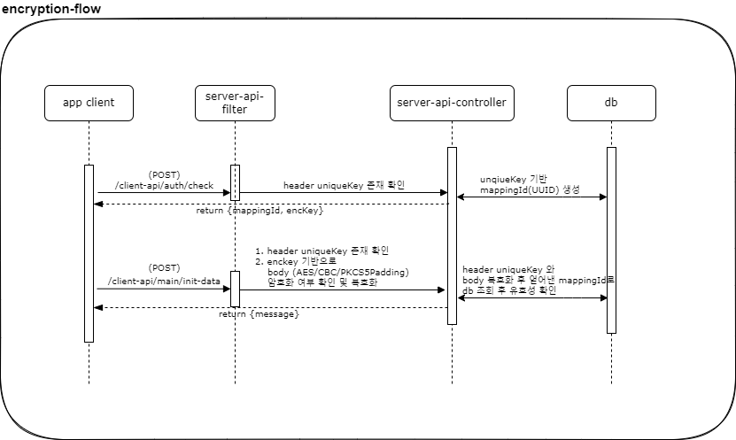
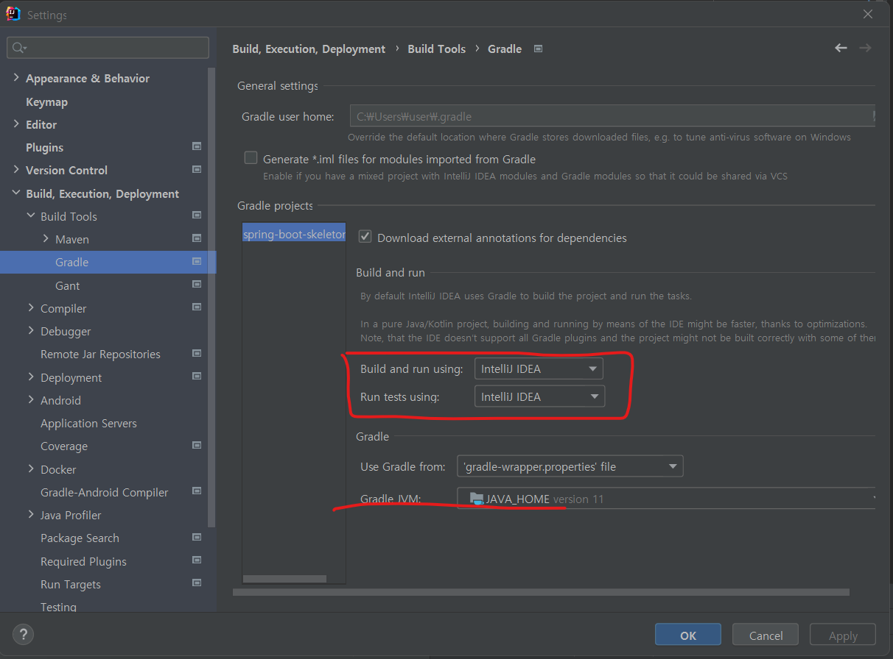
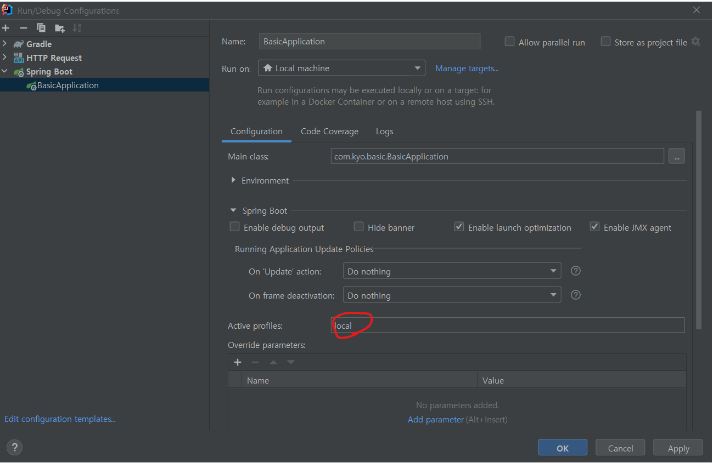

# spring-boot-skeletons24x
spring boot skeleton code 작성하여, 초기 설정을 알아보자

## 암호화 방식


## 로컬 환경 설정
* intellij
    1. before build (```SDK version : openjdk 11```)
       > 
    2. build error
       ````
       터미널에서 build 오류시 - gradle invalid source release: 11
       - gradle.properties 생성 후 본인의 java home 추가
       - 예시 : org.gradle.java.home=C:\\Program Files\\ojdkbuild\\java-11-openjdk-11.0.13-1 
       ````
       ````
       querydsl build 오류시
       - gradle cleanQuerySourceDir, initQuerySourcesDir 후 build 진행
       ````
    3. after build
       > 


## 개발 적용 사항
* spring-boot 2.4.11
    * spring 관련 기본 설정들
      1. redis 
         1. lettuce 사용
         2. local profile embeded redis cache 사용
      2. lombok
      3. logback-spring - logback 설정
      4. properties - properties 설정 불러와 사용
      5. custom banner - init banner 설정
      6. spring profile - 배포를 위한 환경별 프로파일 설정 (application.yml, application-dev.yml)
      7. gitignore - 불필요한 커밋 파일 제외 설정
      8. 기본 config 설정
         1. WebMvcConfigurer 설정
         2. Filter 설정
         3. interceptor 설정
    * test case
      1. spring-rest-docs test case (with junit5)
      2. custom utils test case
    * gradle
      1. dependency 및 jar 생성을 위한 내용 작성
      2. spring-rest-docs 설정법 
      3. querydsl 설정법
    * docker
      1. 도커환경에서 프로파일별 jar 실행 시키기 내용 작성
* restful-api
    * restful sample api 개발
    * encrypytion sample 개발 
    

## 참고 레퍼런스
1. [Spring Boot에서 Spring Rest Docs 사용해보기](https://shinsunyoung.tistory.com/85)
2. [Spring rest docs 적용기 (gradle 7.0.2)](https://velog.io/@max9106/Spring-Spring-rest-docs%EB%A5%BC-%EC%9D%B4%EC%9A%A9%ED%95%9C-%EB%AC%B8%EC%84%9C%ED%99%94)
3. [Spring WebClient 사용법1](https://umbum.dev/1114)
4. [Spring WebClient 사용법2](https://medium.com/@odysseymoon/spring-webclient-%EC%82%AC%EC%9A%A9%EB%B2%95-5f92d295edc0)
5. [AES, RSA](https://velog.io/@osmdark/JAVA%EC%95%94%EB%B3%B5%ED%98%B8%ED%99%94)
6. [Spring AES 암호화 전송하기](https://velog.io/@haerong22/HTTP-%EB%B0%94%EB%94%94-%EB%8D%B0%EC%9D%B4%ED%84%B0-%EC%95%94%ED%98%B8%ED%99%94-%EC%A0%84%EC%86%A1%ED%95%98%EA%B8%B0)
7. [.http를 사용해 Postman 대체하기](https://jojoldu.tistory.com/266)
8. [Spring boot caffeine 캐시 적용](https://blog.yevgnenll.me/posts/spring-boot-with-caffeine-cache)
